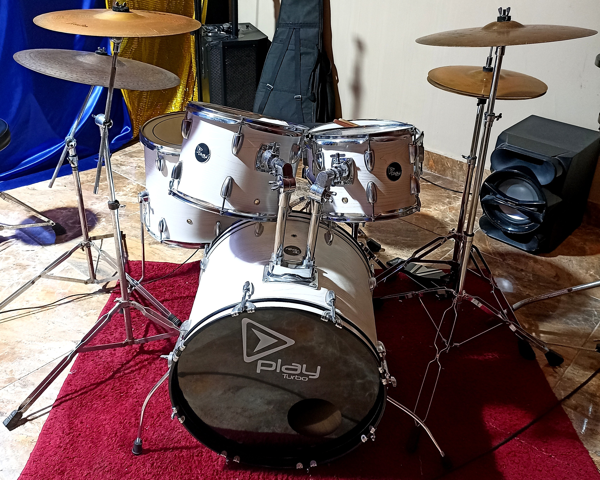
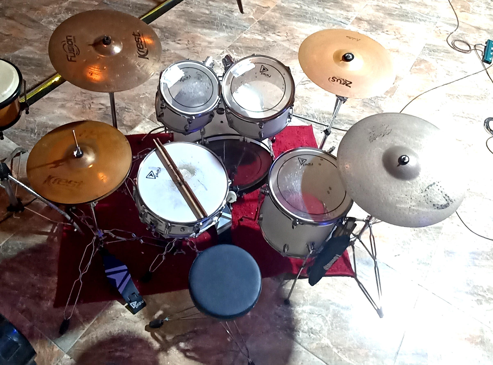

# SS Drummer

> **Versão 24.12.24**

Pacote de samples desenvolvido a partir de gravações exclusivas de bateria acústica, para [sfz](https://sfztools.github.io/sfizz/) e no padrão **General MIDI (GM)**. Ideal para produção musical usando o [sfizz](https://github.com/sfztools/sfizz-ui).

## Microfones e Processamento

- **Gravação:** Microfone interno do celular **Xiaomi Redmi Note 10S**.
- **Software de Gravação:** [ASR Voice Recorder](https://play.google.com/store/apps/details?id=com.nll.asr).
- **Edição e Pós-produção:** Realizada no **Reaper**.
- **Formato dos Arquivos:** WAV (44.1 kHz, 24-bit).

## Configuração do Kit de Bateria

Kit acústico **Turbo Play PLAY22**.
Mais detalhes: [Loja Turbo Music](https://www.lojaturbomusic.com.br/bateria-turbo-play-milk-gold/play22-mkg/-p).

### Especificações

|Instrumento      |Dimensões|Modelo/Marca                                                |
|-----------------|---------|------------------------------------------------------------|
|Bumbo            |22" x 16"|Turbo Play                                                  |
|Caixa            |14" x 6" |Turbo Play                                                  |
|Chimbal          |14"      |Krest Hx14 Hx Series Hi Hat - Par                           |
|Tom 1            |10" x 07"|Turbo Play                                                  |
|Tom 2            |12" x 08"|Turbo Play                                                  |
|Surdo            |14" x 14"|Turbo Play                                                  |
|Prato de Ataque 1|16"      |Crash Krest Fusion Medium 16"                               |
|Prato de Ataque 2|16"      |Crash Zeus Custom Series Traditional 16" ZCC16 em Bronze B20|
|Prato de Condução|20"      |Cymbal Stagg DX-R20 20" Brass Ride                          |

## Mapeamento GM (General MIDI)

|Nota|MIDI|Articulação             |
|----|----|------------------------|
|C1  |36  |Bumbo                   |
|C#1 |37  |Aro da Caixa            |
|D1  |38  |Caixa                   |
|F#1 |42  |Chimbal Fechado         |
|G1  |43  |Surdo                   |
|G#1 |44  |Chimbal com Pedal       |
|A1  |45  |Tom 2                   |
|A#1 |46  |Chimbal Aberto          |
|B1  |47  |Tom 1                   |
|C#2 |49  |Prato de Ataque 1       |
|F2  |51  |Prato de Condução       |
|F2  |53  |Prato de Ataque (Cúpula)|
|C#2 |57  |Prato de Ataque 2       |
|B2  |59  |Prato de Condução       |

## Recursos e Melhorias

- [x]  Até 6 variações round-robin
- [x]  Hihat choke
- [x]  8 Canais
- [x]  Drum Map personalizável
- [x]  Curva de velocity personalizável
- [x]  Midi files
- [ ]  Mixer integrado
